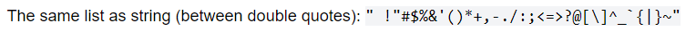

# PasswordGenerator
# 03 JavaScript: Password Generator

This project generates random passwords based on criteria that the user selects. It has a responsive user interface that adapts to multiple screen sizes.

## Table of Contents

- HTML
- CSS
- JavaScipt

## HTML

Index HTML page creates a document that allows user to generate a secure password based on user preferences including lower- and uppercase letters, numbers, and/or special characters.

## CSS

Style sheet provides a classic color style with a red "Generate Password" button. There is also a dotted line around the generated password. Additionally, there is a flex capability that allows the screen to adapt to multiple screen sizes.

## JavaScipt

Provides specific criteria to meet secured password length and user choice criteria as described in HTML section. 

Referenced (https://www.owasp.org/index.php/Password_special_characters) for special characters as shown below in screenshot.
    

## Links
Deployed GitHub Page: https://deven1991.github.io/PwdGenerator/